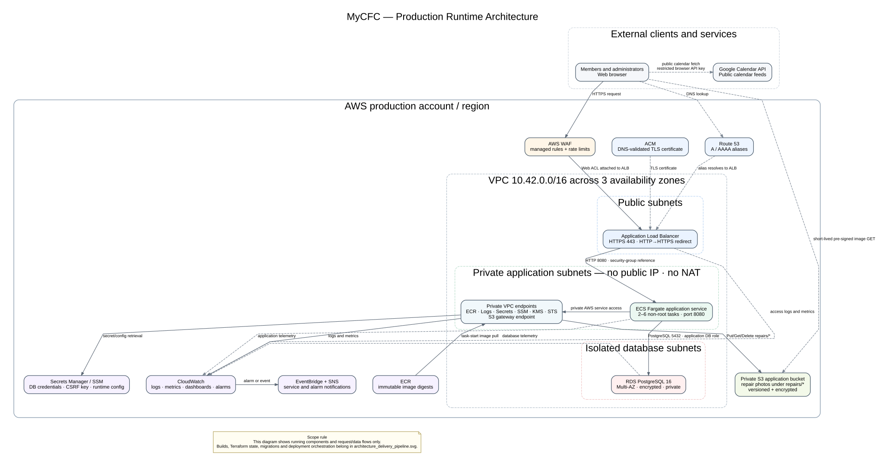
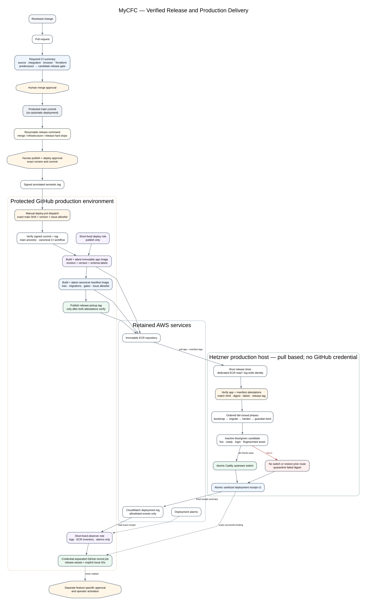

# MyCFC architecture diagrams

The architecture is split into two normative views so runtime behaviour is not confused with delivery orchestration.

## Production runtime



`architecture_runtime.svg` defines:

- Internet-facing and private trust boundaries.
- Browser, DNS, WAF, TLS and ALB request flow.
- ECS application tasks, VPC endpoints and isolated RDS access.
- Private S3 repair-image access.
- Runtime secrets, image pulls, logging, metrics and alerting.

It intentionally excludes GitHub Actions, Terraform state, image builds and migration deployment steps.

## CI/CD and deployment



`architecture_delivery_pipeline.svg` defines:

- Pull-request and main-branch verification.
- Protected GitHub production environment and exact-subject OIDC.
- Terraform plan/apply roles and remote state.
- Immutable ECR image production.
- Separate `mycfc-app` and `mycfc-migrate` task-definition families.
- Migration success as a hard gate before ECS service update.
- Deployment health verification and circuit-breaker rollback.

The full running topology is deliberately represented by one referenced runtime node.

## Editing and regeneration

The `.dot` files are canonical. Regenerate generated images with Graphviz:

```bash
dot -Tsvg architecture_runtime.dot -o architecture_runtime.svg
dot -Tsvg architecture_delivery_pipeline.dot -o architecture_delivery_pipeline.svg

dot -Tpng -Gdpi=130 architecture_runtime.dot -o architecture_runtime_preview.png
dot -Tpng -Gdpi=130 architecture_delivery_pipeline.dot -o architecture_delivery_pipeline_preview.png
```

Do not manually edit the generated SVG markup. The numbered Markdown specifications remain authoritative if a diagram label is necessarily abbreviated.
